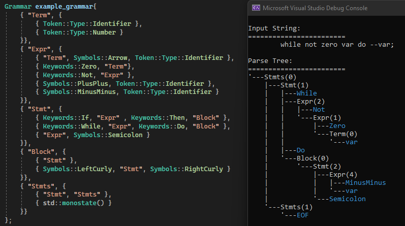
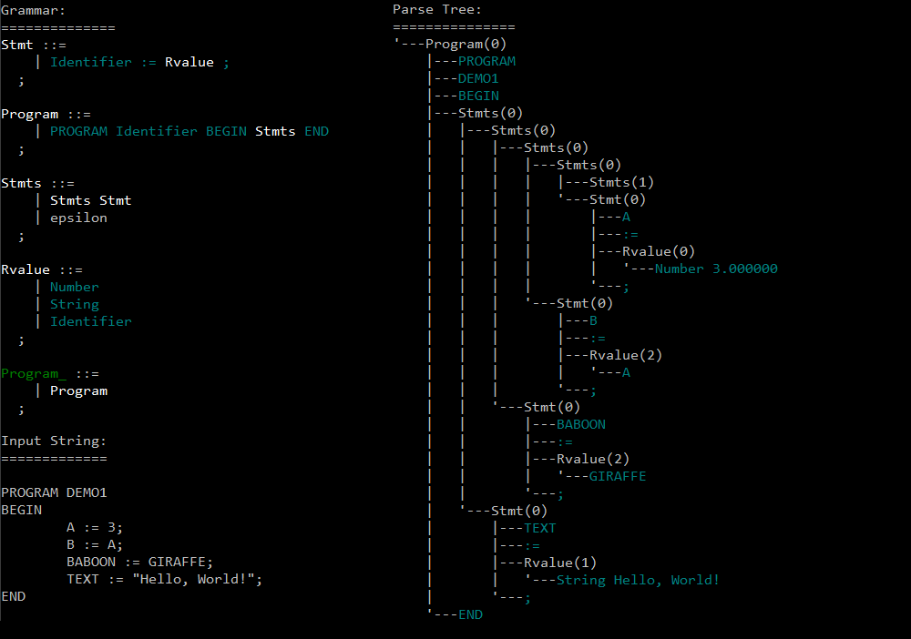

# Dyppyl
A compiler generator written in modern C++.


## Example(s)
NOTE: Dyppyl is under constant developments, so some examples might not match the current state of the code.
```cpp
// define grammar & parser
auto [grammar, lexicon] = (
	dpl::discard |= dpl::kleene{dpl::whitespace},

	"num"t	|= dpl::Lexeme{ dpl::some{dpl::digit}, [](std::string_view str) -> double { return dpl::stod(str); } },

	"E"nt	|= ("E"nt, "+"t, "E"nt) & dpl::Assoc::Left, dpl::Prec{5}
			|  ("E"nt, "*"t, "E"nt) & dpl::Assoc::Left, dpl::Prec{10}
			|  ("("t, "E"nt, ")"t)
			|  ("num"t)
);
dpl::LR1 parser{ grammar, lexicon };

// use parser
dpl::StringStream src{ "1 + 2 * (3 + 4) * 5" };
dpl::ParseTree tree = parser2.parse(src);

// transform from parse tree to AST
tree.replace_with(
	dpl::ParseTree{ "E", {{"("_sym}, {}, {")"_sym}}},
	[](const std::vector<dpl::ParseTree>& cs) { return cs[0]; }
);

tree.replace_with(
	dpl::ParseTree{ "E", {{}, {}, {}} },
	[](const std::vector<dpl::ParseTree>& cs) {
		return dpl::ParseTree{ cs[1].value, {
			(cs[0].match({"E"}) ? cs[0][0].value : cs[0]),
			(cs[2].match({"E"}) ? cs[2][0].value : cs[2])
		}};
	},
	dpl::TraverseOrder::BottomUp
);
```

## What is Dyppyl?

Dyppyl is a compiler-generator library written with modern C++ features.
Usually you'd hear about parser generators, so what's a *compiler* generator?
Dyppyl is mostly just a parser generator, but also includes a suite of tools dedicated specifically for compiler construction.

The cool thing about Dyppyl is that unlike other existing parser generators, it doesn't spit out a source code in some other language.
Instead, Dyppyl will rely on C++'s compile-time metaprogramming facilities to generate the parser (and other stages) directly as an object file, lib/dll, or even executable if your heart desires so.
This gives an added advantage: Dyppyl can be also used as a good ol' runtime library, generating parsers dynamically at runtime. I'm not sure how many actual uses this may have, but it may still be fun to experiment with.

## How's progress?

For detailed progress plans see this very half-assed [Trello board](https://trello.com/b/u2pzCbZc/dyppyl#).
(cards are ordered left-to-right top-to-bottom from highest priority to lowest).

## How does it work?

The theoretical background that goes into this project is pretty advanced, so you don't need to worry about it.
But if you *do* want to know all the tiniest details, check out [Stanford's CS143 Course](https://web.stanford.edu/class/archive/cs/cs143/cs143.1128/) which is where a lot of my knowledge comes from.
If you have a hard time understanding some concepts feel free to ask for my help on Discord (AradArbel10#3813) and maybe we'll figure it out together -- I'm still learning too!

## Goals
- Provide utilities for all stages of compilation
    - At the time of writing, Dyppyl can generate a tokenizer, and a parser (LL(1), LR(0), LR(1)).
    I'd like to continue developing more modular stages for both the frontend and backend parts.
    - Currently the tokenizer supports very little customizability.
    For the future I plan on providing support for lexing based on any arbitrary regular expressions, and better integration with parsers.
    - Allow to modularly assemble backends that could export generated code in any format (C, ASM, bytecode, LLVM IR, etc...) and composed with third-party backends.
    - Include type checkers, static analysis stages, and debug info in the compilation process.

- High runtime performance
    - Most common parser generators produce a result that's compiled separately. With Dyppyl I intend to heavily utilize the metaprogramming capabilities of C++ to perform all the prerequired work at the time of compiling the parser itself.
    - Rather than a parser generator, this would work more similarly to a pre-compiled parsing library that you can include in your own projects.

## How can I use Dyppyl?
Dyppyl is a fully header-only library, so if you want to use it yourself you just need to get all the headers into your project*.

*currently there are dependencies that Dyppyl relies, but some of these likely will be eliminated in the future. you can find them in the `deps/` folder.

## Some Old Examples
These are a little outdated by now, but I keep them here anyway.
#### LL(1) Grammar in-code with generated parse tree


#### LR(1) Grammar with generated parse tree
